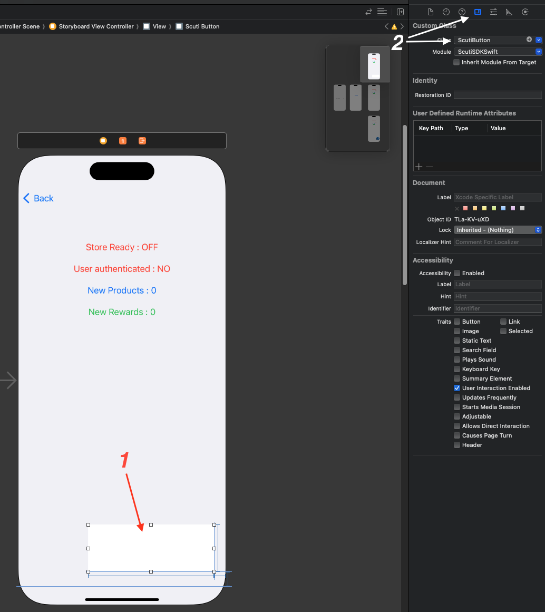

# ScutiSDKSwift

[](https://cocoapods.org/pods/ScutiSDKSwift)
[](https://cocoapods.org/pods/ScutiSDKSwift)
[](https://cocoapods.org/pods/ScutiSDKSwift)

# Requirements

# Installation

### Swift Package Manager

Go to `File | Swift Packages | Add Package Dependency...` in Xcode and search for "scuti-sdk-ios". If multiple results are found, select the one owned by scuti-ai.

### CocoaPods
ScutiSDKSwift is available through [CocoaPods](https://cocoapods.org/pods/ScutiSDKSwift). To install
it, simply add the following line to your Podfile:

````ruby
pod 'SwiftMessages'
````

# Scuti SDK Status
You can read the current Scuti SDK status from `ScutiSDKManager.shared.scutiEvents`.
#### There are several status parameters:
- `isStoreReady: Bool`: Scuti SDK is ready
- `userToken: String`: The user has authenticated and received the user access token from Scuti Store.
- `backToGame: Bool`: The app returned from Scuti Store browser
- `cntNewProducts: Bool`: The number of new products in Scuti Store
- `cntRewards: Bool`: The number of new rewards in Scuti Store for the authenticated user.
- `exchange: ScutiExchangeModel`: The user exchanged from Scuti Store and shows the details.

# Usage

## For Swift project
### Initialize Scuti SDK
In App delegate, please add the following code.
````Swift
    import ScutiSDKSwift
...
    func application(_ application: UIApplication, didFinishLaunchingWithOptions launchOptions: [UIApplication.LaunchOptionsKey: Any]?) -> Bool {
        do {
            try ScutiSDKManager.shared.initializeSDK(environment: .development, appId: "xxxxxxxx-xxxx-xxxx-xxxx-xxxxxxxxxxxx")
        } catch {
            print("initializeSDK ex : \(error)")
        }
        return true
    }

````
###  Add Scuti Button in Storyboard
If you want to add the Scuti SDK button directly to Storyboard, please add a UIView in the UIViewController of the Storyboard or Xib.
And then please change the view's custom class to `ScutiButton`.
<p align="center">
  
</p>

### Add Scuti Button programmatically
In the View controller, 
````Swift
    override func viewDidLoad() {
        super.viewDidLoad()
        let scutiButtonView = ScutiButton(frame: .zero)
        scutiButtonView.translatesAutoresizingMaskIntoConstraints = false
        view.addSubview(scutiButtonView)
        NSLayoutConstraint.activate([
            view.safeAreaLayoutGuide.trailingAnchor.constraint(equalTo: scutiButtonView.trailingAnchor, constant: 10),
            view.safeAreaLayoutGuide.bottomAnchor.constraint(equalTo: scutiButtonView.bottomAnchor, constant: 40),
            scutiButtonView.widthAnchor.constraint(equalToConstant: 260),
            scutiButtonView.heightAnchor.constraint(equalToConstant: 90),
        ])
    }
````
### Add a customized Scuti Button
Please check this [example](https://github.com/scuti-ai/scuti-sdk-ios/blob/main/Scuti/Pages/CustomScutiButtonViewController.swift)

#### Observe Scuti Status
If you want to observe the Scuti SDK status, you can use `ScutiSDKManagerDelegate`
````Swift
override func viewWillAppear(_ animated: Bool) {
    super.viewWillAppear(animated)
    ScutiSDKManager.shared.delegate = self
}
...
extension ViewController: ScutiSDKManagerDelegate {
    func onStoreReady() {
    }
    func onLogout() {
    }
    func onNewProducts(cntProducts: Int) {
    }
    func onNewRewards(cntRewards: Int) {
    }
    func onUserToken(userToken: String) {
    }
    func onScutiButtonClicked() {
    }
    func onBackToGame() {
    }
    func onScutiExchange(exchange: ScutiSDKSwift.ScutiExchangeClass) {
    }
    func onErrorOccurred(error: Error) {
    }
}
````
## For SwiftUI project
### Initialize Scuti SDK
In App, please add the following code.
````Swift
    import ScutiSDKSwift
...
@main
struct MyApp: App {
    init() {
        DispatchQueue.main.asyncAfter(deadline: .now() + 0.1) {
            do {
                try ScutiSDKManager.shared.initializeSDK(environment: .development, appId: "xxxxxxxx-xxxx-xxxx-xxxx-xxxxxxxxxxxx")
            } catch {
                print("initializeSDK ex : \(error)")
            }
        }
    }
    var body: some Scene {
        WindowGroup {
            ContentView()
        }
    }
}
````
> Note: `DispatchQueue.main.asyncAfter(deadline: .now() + 0.1){}` is required for Scuti SDK initialize.

### Common Scuti button usage
You can add the simple code to add the SDK button.
````Swift
    ScutiButtonSwiftUI().frame(width: 260, height: 90)
````
### Add a customized Scuti Button
Please check this [example](https://github.com/scuti-ai/scuti-sdk-ios/blob/main/ScutiSwiftUI/Pages/CustomView.swift)

#### Observe Scuti Status
If you want to observe the Scuti SDK status, you can use `ScutiSDKManagerDelegate`.
_Alternatively, you can directly use `ScutiSDKManager.shared.scutiEvents` declared as @ObservedObject variable._
##### Example:
````Swift
    CustomView().environmentObject(ScutiSDKManager.shared.scutiEvents)
...
struct CustomView: View {
    @EnvironmentObject var scutiEvents: ScutiModel
    var body: some View {
        VStack {
            Text("Store Ready : \(scutiEvents.isStoreReady ? "ON" : "OFF")").foregroundColor(.red).padding()
            Text("User authenticated :  \(scutiEvents.userToken != nil ? "YES" : "NO")").foregroundColor(.red).padding()
            Text("New Products : \(scutiEvents.cntNewProducts)").foregroundColor(.blue).padding()
            Text("New Rewards : \(scutiEvents.cntRewards)").foregroundColor(.green).padding()
            ScutiButtonSwiftUI().frame(width: 260, height: 90)
        }
    }
}
````

## For Objective C project
### Initialize Scuti SDK
In App delegate, please add the following code.
````ObjC
@import ScutiSDKSwift;
...
- (BOOL)application:(UIApplication *)application didFinishLaunchingWithOptions:(NSDictionary *)launchOptions {
    [[ScutiSDKManager shared] initializeSDKWithEnvironment:TargetEnvironmentDevelopment appId:@"xxxxxxxx-xxxx-xxxx-xxxx-xxxxxxxxxxxx" error:nil];
    return YES;
}

````
###  Add Scuti Button in Storyboard
If you want to add the Scuti SDK button directly to Storyboard, please add a UIView in the UIViewController of the Storyboard or Xib.
And then please change the view's custom class to `ScutiButton`.
### Add Scuti Button programmatically
In the View controller, 
````ObjC
- (void)viewDidLoad {
    [super viewDidLoad];
    ScutiButton * scutiButtonView = [[ScutiButton alloc] initWithFrame:CGRectZero];
    scutiButtonView.translatesAutoresizingMaskIntoConstraints = false;
    [self.view addSubview:scutiButtonView];
    
    [NSLayoutConstraint activateConstraints:@[
        [self.view.safeAreaLayoutGuide.trailingAnchor constraintEqualToAnchor:scutiButtonView.trailingAnchor constant:10],
        [self.view.safeAreaLayoutGuide.bottomAnchor constraintEqualToAnchor:scutiButtonView.bottomAnchor constant:40],
        [scutiButtonView.widthAnchor constraintEqualToConstant:260],
        [scutiButtonView.heightAnchor constraintEqualToConstant:90]
    ]];
}
````
### Add a customized Scuti Button
Please check this [example](https://github.com/scuti-ai/scuti-sdk-ios/blob/main/ExampleScutiObjC/Pages/CustomScutiButtonViewController.m)

#### Observe Scuti Status
If you want to observe the Scuti SDK status, you can use `ScutiSDKManagerDelegate`
````ObjC
- (void)viewWillAppear:(BOOL)animated {
    [super viewWillAppear:animated];
    ScutiSDKManager.shared.delegate = self;
}
...
#pragma mark - ScutiSDKManagerDelegate
- (void)onBackToGame {
}
- (void)onErrorOccurredWithError:(NSError * _Nonnull)error {
}
- (void)onLogout {
}
- (void)onNewProductsWithCntProducts:(NSInteger)cntProducts {
}
- (void)onNewRewardsWithCntRewards:(NSInteger)cntRewards {
}
- (void)onScutiButtonClicked {
}
- (void)onScutiExchangeWithExchange:(ScutiExchangeClass * _Nonnull)exchange {
}
- (void)onStoreReady {
}
- (void)onUserTokenWithUserToken:(NSString * _Nonnull)userToken {
}
````
## Author

Mark Grossnickle, markgrossnickle@users.noreply.github.com
Adrian Rusin, arusin@users.noreply.github.com

## License

ScutiSDKSwif is available under the MIT license. See the LICENSE file for more info.
